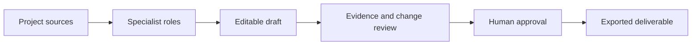

<h1 align="center">DSH Work</h1>

<p align="center"><strong>Turn project sources into reviewable office deliverables with DeepSeek Harness.</strong></p>

<p align="center">
  <a href="https://github.com/HuangYuChuh/dsh-work/actions/workflows/docs.yml"></a>
  <a href="LICENSE"></a>
  <a href="https://github.com/HuangYuChuh/dsh-work/commits/main"></a>
  <a href="https://github.com/deepseek-ai/deepseek-harness"></a>
</p>

DSH Work is a local-first office agent workspace for analysts, researchers,
operations teams, and consultants. It turns project files and research into
cited, editable reports, spreadsheets, and presentations that a person can
inspect and approve before they leave the workspace.

> **Foundation phase:** the repository currently defines the product and
> architecture. It does not yet provide an installable desktop application or
> a production-ready office workflow.



## Why DSH Work

The hard part of office automation is not generating a paragraph. It is making
the path from evidence to deliverable visible enough for a professional to
trust and approve.

DSH Work uses [DeepSeek Harness](https://github.com/deepseek-ai/deepseek-harness)
as a composable agent runtime. Its profiles, presets, plugins, workflows, and
subagents become business concepts such as projects, roles, sources,
deliverables, and approvals.

## The first workflow

The first release has one narrow job: **sources to deliverables**.

1. Create a local project from a folder.
2. Add PDF, DOCX, XLSX, PPTX, and web sources.
3. Assign research, analysis, writing, and review roles.
4. Produce an editable report, spreadsheet, or presentation draft.
5. Review evidence, citations, and file changes before export.

Email, calendar, IM, Drive, Notion, and enterprise connectors come later. The
document workflow must be dependable first.

## What the product must prove

- **Keep evidence visible.** Claims in a deliverable should point back to a
  source file, page, section, URL, tool result, or clearly labelled inference.
- **Keep files editable.** A useful result is a DOCX, XLSX, PPTX, or PDF that
  can be inspected and revised, not a markdown answer trapped in chat.
- **Keep consequential actions reviewable.** Exporting, publishing, sending,
  overwriting, moving, and deleting require an explicit approval policy.
- **Keep roles bounded.** A researcher, analyst, writer, and reviewer should
  have distinct tools and responsibilities instead of one opaque super-agent.

## How DSH maps to office work

| DeepSeek Harness primitive | DSH Work concept |
| --- | --- |
| Workspace | Project, client folder, or research case |
| Agent preset | Researcher, analyst, writer, or reviewer |
| Plugin | Document parser, citation service, Office generator, or connector |
| Session | One work thread inside a project |
| Workflow | A repeatable multi-role office procedure |
| Approval | Permission to export, send, publish, overwrite, move, or delete |
| Subagent | A bounded specialist working for another role |

## Current status

The repository now includes a reproducible DSH Web Profile backed by a pinned
submodule. It proves the runtime and browser surface can be started locally;
the first Office tool bundle is now wired into the profile. Citation
provenance, review UX, and approval-aware export remain the next product
milestones.

## Run the local DSH profile

Requirements: Node.js `^22.19.0` (or `>=24.0.0`) and pnpm `11.7.0`.

```powershell
git clone https://github.com/HuangYuChuh/dsh-work.git
cd dsh-work
git submodule update --init --recursive
cd packages/deepseek-harness
pnpm install --ignore-scripts
pnpm run build
cd ../..
cd .dsh/profiles/work
pnpm install --ignore-scripts
cd ../../..
.\scripts\dsh-work.ps1 --dump-config
.\scripts\dsh-work.ps1 --port 3080
```

The script sets `DSH_HOME` to the repository's `.dsh` directory and selects
the tracked `work` profile. `--dump-config` is a useful first check: it shows
the effective Cordis rows without starting a server. The Web UI prints its
actual URL; `--port 0` asks Windows to choose a free port.

The first install uses `--ignore-scripts` because the upstream checkout's
optional Git-hook postinstall is not compatible with a Git submodule. It does
not skip the build or runtime dependencies. The second install resolves the
Profile's external Office bundle with `autoInstallPeers: false`, so it reuses
the DSH checkout's current Cordis and tool registry instead of trying to fetch
legacy peer packages.

The `work` profile installs `@huiliyi37/dsh-office@0.1.6` as an external DSH
bundle. It currently exposes `xlsx_*`, `pdf_*`, `pptx_*`, and `docx_*` tools;
the profile patch keeps all four families explicit so a later product release
can narrow the tool surface without changing the upstream bundle.

## Documentation

| Document | What it answers |
| --- | --- |
| [Architecture](docs/architecture.md) | How DSH and the office product layer fit together |
| [Product positioning](docs/product-positioning.md) | Who the product serves and what it will not become |
| [Ecosystem landscape](docs/landscape.md) | Which DSH office projects we verified and how they differ |
| [SEO and GEO foundations](docs/seo-geo.md) | How public claims stay discoverable and factual |
| [llms.txt](llms.txt) | Concise machine-readable project facts |

## For DSH builders

DSH Work will be built as a product layer over the upstream runtime, not as a
replacement for it. Contributions should strengthen one of four paths:

1. DSH office profiles, presets, and plugin composition.
2. Safe PDF, DOCX, XLSX, and PPTX ingestion.
3. Structured, editable deliverable generation and preview.
4. Citation, review, and approval UX.

See [CONTRIBUTING.md](CONTRIBUTING.md) for the current contribution boundary.

## Project relationship

DSH Work is an independent community project. "DeepSeek Harness" and "DSH"
refer to the upstream open-source runtime; their use here does not imply
endorsement, partnership, or official support from DeepSeek.

## License

This repository is available under the [MIT License](LICENSE).
