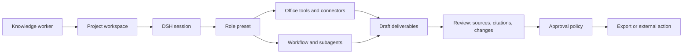

# Architecture

## Product goal

DSH Work is a product layer over DeepSeek Harness, not a fork that replaces
the DSH runtime. The product must make office work inspectable: a user should
be able to see the sources used, roles involved, files changed, and actions
awaiting approval.

## Runtime shape



The technical planes remain separate:

| Plane | Responsibility | Example |
| --- | --- | --- |
| DSH host profile | Shared runtime services | Provider access, workspace policy, approval service, schedules, workflow worker |
| DSH agent preset | Per-session role composition | Researcher with web research and source-reading tools |
| DSH plugin | A replaceable capability | DOCX parser, XLSX generator, citation recorder |
| DSH Work product layer | Office language and interaction | Project, source, deliverable, reviewer, and approval views |

## Required product capabilities

### Document ingestion

Office work starts with heterogeneous files. The product needs an explicit
generic file pipeline for PDF, DOCX, XLSX, and PPTX: storage, extraction,
preview metadata, parsing limits, and safety treatment of untrusted source
content. DSH's current image-oriented attachment surface is insufficient on
its own.

### Structured deliverables

The agent must create editable output, not only markdown in a chat transcript.
Generation should use structure-aware document, spreadsheet, and presentation
libraries or dedicated Office tools. Rendering and review must feed back into
the same task before the user exports a file.

### Source and citation provenance

Every claim in a deliverable should be traceable to source files, pages,
sections, URLs, tool output, or stated model inference. The UI should clearly
separate evidence from generated interpretation.

### Office approvals

DSH Work needs policies that describe business actions rather than technical
tool names. Send email, publish, overwrite spreadsheet, move/delete a source,
and export a final deliverable are separate approval classes.

## First workflow

```text
Local project folder
  -> collect sources
  -> research and extract evidence
  -> analyze facts and data
  -> create editable draft
  -> reviewer checks citations and output
  -> human approves export
```

This deliberately excludes broad enterprise automation until document quality,
provenance, and review are reliable.

## Non-goals for the first release

- Reimplementing a full Word, Excel, or PowerPoint editor.
- Replacing the upstream DSH runtime or its plugin system.
- Allowing high-impact external actions without an approval policy.
- Shipping a terminal- and Git-centric developer UI as the primary experience
  for knowledge workers.
